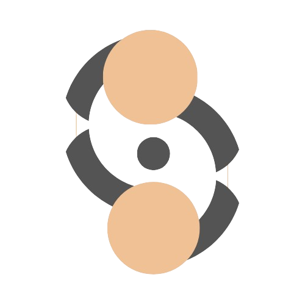

<div id="readme-top"></div>

<div align="center">
  <a href="https://github.com/othneildrew/Best-README-Template">
    
  </a>

  <h1 align="center">Huddle</h1>

  <p align="center">
    Gather - Connect - Chat
    <br />
    <a href="https://github.com/boyandmtrv/Huddle"><strong>Discover the docs</strong></a>
  </p>
</div>

<details>
  <summary>Table of Contents</summary>
  <ol>
    <li>
      <a href="#about-the-project">About The Project</a>
        <li><a href="#built-with">Built With</a></li>
    </li>
    <li>
      <a href="#getting-started">Getting Started</a>
        <li><a href="#installation">Installation</a></li>
      </li>
    <li><a href="#usage">Usage</a></li>
    <li><a href="#license">License</a></li>
    <li><a href="#contact">Contact</a></li>
    <li><a href="#acknowledgments">Acknowledgments</a></li>
  </ol>
</details>

## About The Project


Huddle chat is a simple chat application that allows users to create and join chat rooms smoothly. Whether you want to have a conversation with your colleagues, chat with your buddies, or simply have a private chat space for you and your friend, Huddle makes it happen. 

Why Huddle?
* Huddle offers user-friendly interface, ensuring enjoyable chatting experience for users of all levels.
* Effortlessly create chat rooms by entering your desired name and unique room ID. Joining exisiting conversations is just a simple.
* Enjoy the benefits of real-time communication within your chat rooms. Huddle ensures that your messages are delivered instantly.

<p align="right">(<a href="#readme-top">back to top</a>)</p>

### Built With
[](https://react.dev/) <br/>
[](https://reactrouter.com/) <br/>
[](https://expressjs.com/) <br/>
[](https://socket.io/) <br/>
[](https://nodemon.io/) <br/>
[](https://www.npmjs.com/package/cors) <br/>
[](https://tailwindcss.com/) <br/>
[](https://react-icons.github.io/react-icons/) <br/>
[](https://www.npmjs.com/package/react-scroll-to-bottom) <br/>
[](https://fkhadra.github.io/react-toastify/) <br/>
[](https://vitejs.dev/) <br/>

<p align="right">(<a href="#readme-top">back to top</a>)</p>

## Getting Started

To get a local copy up and running follow these simple example steps.
  
### Installation

1. Clone the repo
   ```sh
   git clone https://github.com/boyandmtrv/Huddle.git
   ```
2. Install NPM packages on the clients folder
   ```sh
   cd .\client\
   ```
   ```sh
   npm install
   ```
3. Install NPM packages on the clients folder
   ```sh
   cd .\server\
   ```
   ```sh
   npm install
   ```

<p align="right">(<a href="#readme-top">back to top</a>)</p>

## Usage

Use this space to show useful examples of how a project can be used. Additional screenshots, code examples and demos work well in this space. You may also link to more resources.

### Run the server
1. Open a new terminal and enter the server folder
   ```sh
   cd .\server\
   ```
2. Run the back-end application
   ```sh
   node .\server.js
   ```
   *If eveything is fine you will receive the following message in the terminal:
   Server is listening on port 5000*

### Run the app
1. Open a new terminal and enter the client folder
   ```sh
    cd .\client\
   ```
2. Run the front-end application
   ```sh
   npm run dev
   ```
   *To open the application locally, enter the following url in the browser field: http://localhost:5173/ or use CTRL + left click in the terminal box*

You can also check out the live version of Huddle by clicking [here](https://huddle-chat-plum.vercel.app/)


<p align="right">(<a href="#readme-top">back to top</a>)</p>

## License

Distributed under the MIT License. See `LICENSE` for more information.

<p align="right">(<a href="#readme-top">back to top</a>)</p>

## Contact

[](https://www.linkedin.com/in/boyan-dimitrov-4402b4179/) <br />
[](mailto:boyandimitrov1462@gmail.com) <br />
[](https://github.com/boyandmtrv) <br />


<p align="right">(<a href="#readme-top">back to top</a>)</p>


